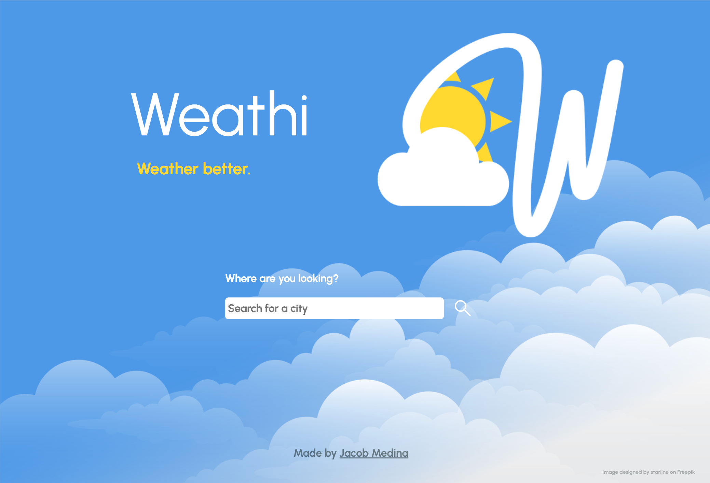
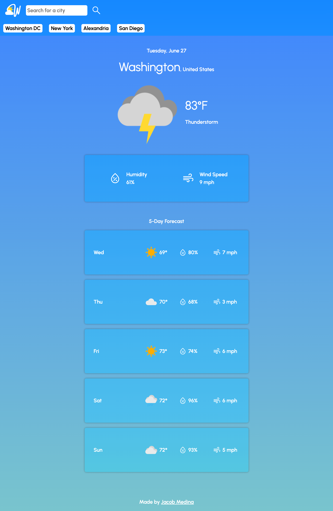
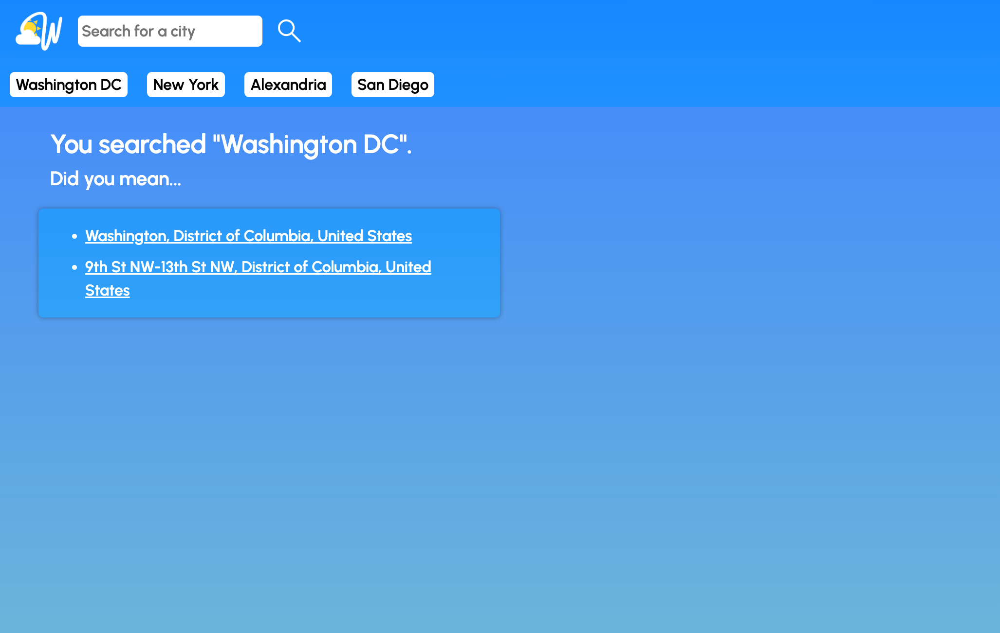

#  Weathi

## Description

[Click here to visit the live website.](https://jacob-medina.github.io/weathi/)

A clean and simple weather app that provides current and future forecasts for any city in the world.

The aim of this project is to provide a free, fast, and simple weather tracking service for travelers. Using the OpenWeatherMap API, Weathi allows a users to get the weather of any location from just the city name, regardless of the country.

## Usage

A user may do the following:
- Resize the window to get a layout that is appropriate for the screen dimensions
- Type a city name inside the search bar to get the weather for that city. The searched city is saved in local storage

- Click on a specific city name if Weathi finds duplicate city names

- Click on a saved search button to get the weather for that location

## Code Source

The files that were edited in this project can be found through the following path (from root):
- `index.html`
- `search-results.html`
- `assets/css/style.css`
- `assets/css/index-style.css`
- `assets/css/search-results-style.css`
- `assets/js/script.js`

## Credits

The [Weathi logo](./assets/images/logo/) and [weather icons](./assets/images/weather-icons/) were designed by me.

The [cloud background image](./assets/images/cloud-background.png) on the home page (`index.html`) was not created by me. It is owned by the following:
- > Designed by [starline](https://www.freepik.com/author/starline), hosted on [Freepik](https://www.freepik.com/free-vector/gorgeous-clouds-background-with-blue-sky-design_8562848.htm)

The following resources were used to assist in the development of this project:
- [OpenWeatherMap](https://openweathermap.org/)
- [Day.js](https://day.js.org/)
- [jQuery](https://jquery.com/)
- [Bootstrap](https://getbootstrap.com/)
- [List of country names and codes](https://gist.github.com/keeguon/2310008#file-countries-json)
  - > Created by [Félix Bellanger](https://gist.github.com/keeguon)

## License

This project is made under the [MIT License](./LICENSE).